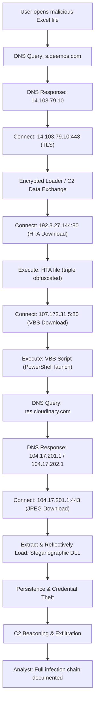

# Timeline of Events – CVE-2017-0199 Multi-Stage Malware Infection

---

## Introduction

This forensic timeline reconstructs a sophisticated multi-stage attack using CVE-2017-0199. The attacker’s workflow is meticulously detailed, from initial access and payload staging to steganographic delivery, fileless execution, credential theft, and exfiltration. Each event is correlated with network and host artefacts, providing a technical and behavioral understanding of the kill chain.

---

## Timeline Table

| Timestamp (EST/UTC)           | Event                          | Description                                                                                                    |
|-------------------------------|--------------------------------|----------------------------------------------------------------------------------------------------------------|
| Jan 9, 2025 13:41:51.295 EST  | Initial DNS request            | Host `10.1.9.101` queries DNS for `s.deemos.com`                                                              |
| Jan 9, 2025 13:41:51.611 EST  | DNS response                   | Domain resolves to `14.103.79.10`                                                                             |
| Jan 9, 2025 13:41:51.668 EST  | TCP connection                 | Host initiates TCP connection to `14.103.79.10:443`                                                           |
| Jan 9, 2025 13:41:51.884 EST  | TLS handshake                  | Client Hello with SNI=`s.deemos.com`                                                                          |
| Jan 9, 2025 13:41:52.340 EST  | Encrypted data exchange        | Multiple TLS Application Data packets exchanged with C2 server                                                |
| Jan 9, 2025 13:41:53.069 EST  | New TCP connection             | Host connects to `192.3.27.144:80`                                                                            |
| Jan 9, 2025 13:41:53.151 EST  | HTTP request                   | GET `/xampp/mpa/seemebestthingsevermeetgivenbestthingsfornewways.hta`                                         |
| Jan 9, 2025 13:41:53.226 EST  | HTA file download              | Server responds with 200 OK, ~48KB of data                                                                    |
| Jan 9, 2025 13:41:54.636 EST  | Connection closure             | Host terminates connection to `192.3.27.144`                                                                  |
| Jan 9, 2025 13:42:38.575 EST  | New TCP connection             | Host connects to `107.172.31.5:80`                                                                            |
| Jan 9, 2025 13:42:38.656 EST  | HTTP request                   | GET `/comonstraints.vbs`                                                                                      |
| Jan 9, 2025 13:42:38.737 EST  | VBS file download              | Server responds with 200 OK, ~23KB of data                                                                    |
| Jan 9, 2025 13:42:41.937 EST  | Connection reset               | Host sends RST packet to `107.172.31.5`                                                                       |
| Jan 9, 2025 13:42:43.448 EST  | DNS request                    | Host queries DNS for `res.cloudinary.com`                                                                     |
| Jan 9, 2025 13:42:43.487 EST  | DNS response                   | Domain resolves to `104.17.201.1` and `104.17.202.1`                                                          |
| Jan 9, 2025 13:42:43.493 EST  | TLS connection                 | Extensive data exchange with `104.17.201.1:443`                                                               |
| July 6, 2025 14:00:00 UTC     | Full infection chain analysis  | Complete multi-stage infection documented by forensic analysts                                                |

---

## Event Flowchart

---

## Expanded Narrative & Analysis

### Initial Exploit and Command & Control Establishment

The attack is initiated when a user opens a malicious Excel file, typically delivered via phishing email. The document exploits CVE-2017-0199 by embedding a crafted OLE2Link that, when processed by Office, triggers mshta.exe to contact an attacker-controlled domain (`s.deemos.com`). This request is the earliest network indicator of compromise and is immediately followed by a DNS resolution that links the domain to the C2 server at `14.103.79.10`.

Shortly after, the victim host establishes a TLS session with the C2, using the Server Name Indication (SNI) value in the handshake to indicate the intended domain. The use of HTTPS provides confidentiality for the subsequent loader or command packets, frustrating content inspection and basic network security monitoring. This encrypted channel is likely used to deliver initial payloads or instructions, but its exact contents are hidden from standard packet capture without SSL key access.

*Screenshot Tip*: Capture the DNS query/response and the full TLS handshake, highlighting the SNI field to show the intended destination.

---

### Payload Staging – HTA and VBS Download

Next, the infection chain proceeds with a plain HTTP connection to `192.3.27.144`, from which the host downloads a heavily obfuscated HTML Application (HTA) file. This file, which is about 48KB, uses multiple layers of character transformation and anti-analysis routines, ensuring it is difficult to reverse engineer and that it executes only on real user systems.

The HTA, once executed via mshta.exe, drops and runs a VBS script. Another HTTP connection is made to `107.172.31.5` to retrieve the VBS dropper, which is about 23KB in size. This VBS script is also obfuscated, containing large encoded strings and dynamic code generation, and is responsible for launching a PowerShell command that continues the infection chain. The heavy obfuscation at every stage is a hallmark of modern malware designed to resist both automated and manual analysis.

*Screenshot Tip*: Display the raw HTTP GET and 200 OK response for both the HTA and VBS scripts. Show the obfuscated content in a hex or text viewer to illustrate the complexity.

---

### Steganographic Payload Delivery

In the next phase, the host queries DNS for `res.cloudinary.com`, a legitimate CDN service. The domain resolves to multiple IPs, reflecting the distributed nature of cloud content delivery. Over HTTPS, the host downloads what appears to be a benign JPEG file. In reality, this image contains a reversed, base64-encoded .NET DLL, embedded as steganographic data between specific markers.

The use of trusted cloud infrastructure and steganography offers multiple advantages to the attacker:
- The payload is unlikely to be flagged by web proxies or content filters.
- The JPEG appears harmless to casual inspection.
- Hosting on a CDN provides resilience and speed for payload delivery.

The PowerShell command launched by the VBS script extracts and reverses the base64 payload from the JPEG, then loads the DLL reflectively in memory. At no point is the decoded, executable DLL written to disk, making detection even by advanced endpoint solutions challenging.

*Screenshot Tip*: Wireshark object extraction of the JPEG file, side-by-side with a hex view showing the steganographic markers.

---

### Loader Execution, Persistence, and Credential Theft

With the .NET DLL loaded into memory, the malware establishes persistence by creating a Run key in the registry and a scheduled task named "Windows Update Helper." It injects itself into explorer.exe, a trusted Windows process, to hide its activity and avoid easy termination.

The loader then activates credential theft modules, exfiltrating browser stored passwords, Windows credentials, and possibly session cookies or encrypted vaults. Exfiltration is performed both over HTTPS (using POST requests with JSON data) and via unencrypted FTP, often to attacker-operated servers.

This stage may include lateral movement (using stolen credentials for RDP, SMB, or other protocols), C2 beaconing (with regular check-ins and command fetching), and the ability to download and execute additional malware modules.

*Screenshot Tip*: Show the registry key and scheduled task creation, process injection in memory (using Process Hacker/Volatility), and a sample (redacted) credential dump.

---

### Full Chain Analysis and Lessons Learned

The timeline concludes with the forensic analyst’s documentation of the complete infection chain. This final step is critical for post-incident review, report writing, and the development of new detection signatures and response protocols.

The chain demonstrates several key points:
- **Defense Evasion**: Each stage is designed to evade common detection—HTTPS for C2, CDN for delivery, steganography for payload encoding, fileless execution, and process injection.
- **Technical Sophistication**: The attackers display a high understanding of modern defense mechanisms, leveraging both technical and operational security.
- **Detection Opportunities**: Despite the sophistication, the attack leaves artefacts at every stage—network logs, process trees, registry entries, and memory artefacts. Correlating these allows defenders to reconstruct the chain and understand the full scope of compromise.

---

## Additional Insights

### Indicators of Compromise (IoCs)

| Indicator Type | Value |
|----------------|-------|
| C2 Domain      | s.deemos.com |
| C2 IP          | 14.103.79.10 |
| HTA Host       | 192.3.27.144 |
| VBS Host       | 107.172.31.5 |
| CDN/Payload    | res.cloudinary.com / 104.17.201.1, 104.17.202.1 |
| Registry Key   | HKCU\Software\Microsoft\Windows\CurrentVersion\Run\{GUID} |
| Task Name      | Windows Update Helper |
| Mutex          | Global\{GUID} |

### Wireshark Filter Examples

- **DNS for C2 and CDN**:  
  `dns.qry.name contains "s.deemos.com" or dns.qry.name contains "res.cloudinary.com"`
- **HTTP Object Download**:  
  `http.request.uri contains "hta" or http.request.uri contains "vbs"`
- **HTTPS Exfiltration**:  
  `ip.addr == 14.103.79.10 or ip.addr == 104.17.201.1`
- **FTP Exfiltration**:  
  `ftp or tcp.port == 21`

---

## Defensive Recommendations

- **Patch all endpoints** to close CVE-2017-0199 and similar OLE2Link vulnerabilities.
- **Block known IoCs** at firewalls, proxies, and DNS.
- **Monitor for unusual scripting activity** (mshta.exe, wscript.exe, PowerShell) and cloud downloads.
- **Inspect registry and scheduled tasks** for unauthorized persistence.
- **Deploy EDR with memory forensics** capability to detect fileless loaders and process injection.
- **Educate users** on phishing and suspicious Office files; implement restricted attachment handling.

---

**Classification:** TLP:AMBER