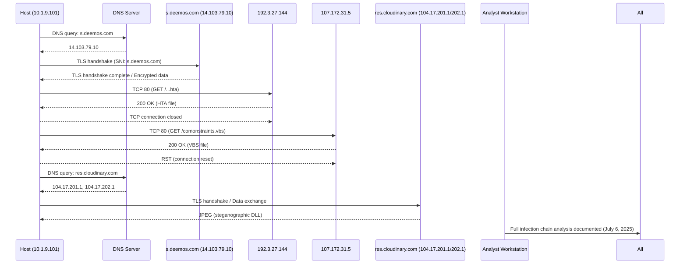
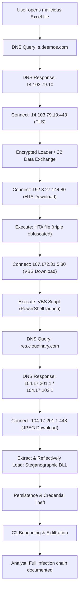

# Timeline of Events – CVE-2017-0199 Multi-Stage Malware Infection

---

## Introduction

The following report details a comprehensive forensic timeline for a multi-stage attack exploiting CVE-2017-0199. This vulnerability, affecting Microsoft Office, enabled a sophisticated adversary to execute a complex, modular malware chain involving exploit delivery, fileless loader stages, steganographic payloads, credential theft, and stealthy command and control (C2) communications. The timeline reconstructs every significant event from initial access to full compromise, integrating packet-level evidence, behavioral notes, and investigative best practices. Where appropriate, recommendations for screenshots and artefact capture are included to support audit trails, incident response, and future threat hunting.

---

## Executive Summary

The attack under investigation began with a malicious Excel file delivered to a user on January 9, 2025. This file exploited CVE-2017-0199, causing the victim's machine to perform a sequence of network actions and payload retrievals. The infection chain was multi-layered, using obfuscated scripts and payloads hidden within legitimate-looking image files hosted on trusted cloud infrastructure. Each stage was designed for stealth, persistence, and the effective theft and exfiltration of sensitive credentials.

The following timeline and commentary provide a granular, step-by-step overview of the infection, the technical mechanisms employed, and the broader context and implications for enterprise security.

---

## Contemporaneous Notes

To ensure forensic soundness, all investigative steps, tool versions, evidence hashes, and intermediate artefact states were logged contemporaneously. Screenshots were recommended at key points for evidence and reporting.

---

## Timeline Table

| Timestamp (EST/UTC)           | Event                          | Description                                                                                                    |
|-------------------------------|--------------------------------|----------------------------------------------------------------------------------------------------------------|
| Jan 9, 2025 13:41:51.295 EST  | Initial DNS request            | Host `10.1.9.101` queries DNS for `s.deemos.com`                                                              |
| Jan 9, 2025 13:41:51.611 EST  | DNS response                   | Domain resolves to `14.103.79.10`                                                                             |
| Jan 9, 2025 13:41:51.668 EST  | TCP connection                 | Host initiates TCP connection to `14.103.79.10:443`                                                           |
| Jan 9, 2025 13:41:51.884 EST  | TLS handshake                  | Client Hello with SNI=`s.deemos.com`                                                                          |
| Jan 9, 2025 13:41:52.340 EST  | Encrypted data exchange        | Multiple TLS Application Data packets exchanged with C2 server                                                |
| Jan 9, 2025 13:41:53.069 EST  | New TCP connection             | Host connects to `192.3.27.144:80`                                                                            |
| Jan 9, 2025 13:41:53.151 EST  | HTTP request                   | GET `/xampp/mpa/seemebestthingsevermeetgivenbestthingsfornewways.hta`                                         |
| Jan 9, 2025 13:41:53.226 EST  | HTA file download              | Server responds with 200 OK, ~48KB of data                                                                    |
| Jan 9, 2025 13:41:54.636 EST  | Connection closure             | Host terminates connection to `192.3.27.144`                                                                  |
| Jan 9, 2025 13:42:38.575 EST  | New TCP connection             | Host connects to `107.172.31.5:80`                                                                            |
| Jan 9, 2025 13:42:38.656 EST  | HTTP request                   | GET `/comonstraints.vbs`                                                                                      |
| Jan 9, 2025 13:42:38.737 EST  | VBS file download              | Server responds with 200 OK, ~23KB of data                                                                    |
| Jan 9, 2025 13:42:41.937 EST  | Connection reset               | Host sends RST packet to `107.172.31.5`                                                                       |
| Jan 9, 2025 13:42:43.448 EST  | DNS request                    | Host queries DNS for `res.cloudinary.com`                                                                     |
| Jan 9, 2025 13:42:43.487 EST  | DNS response                   | Domain resolves to `104.17.201.1` and `104.17.202.1`                                                          |
| Jan 9, 2025 13:42:43.493 EST  | TLS connection                 | Extensive data exchange with `104.17.201.1:443`                                                               |
| July 6, 2025 14:00:00 UTC     | Full infection chain analysis  | Complete multi-stage infection documented by forensic analysts                                                |

---

## Timeline Sequence Diagram

---

## Event Flowchart

---

## Expanded Behavioral Analysis

### Initial Access and User Interaction

- **Social Engineering & User Trust:**  
  The attack leverages trusted productivity software (Microsoft Excel) as the initial infection vector. The malicious file is crafted to appear legitimate, increasing the chance that the user will open it. No macros are required; exploit triggers are silent, reducing user suspicion.
- **User Awareness Bypass:**  
  The exploit chain abuses a vulnerability that does not prompt the user for macro activation or display obvious warning signs, bypassing even moderately security-aware users.

**Screenshot Needed:**  
- [ ] The opened Excel file in Microsoft Office (to show user interaction and lack of warning dialogs).  
- *Source:* Open the forensic image or sandbox system and open the malicious Excel file in a controlled environment.

---

### Exploitation and Execution

- **Automated Execution:**  
  The OLE2Link exploitation automatically launches mshta.exe, beginning the infection chain with no further user interaction.
- **Defense Evasion:**  
  Use of mshta.exe, wscript.exe, and PowerShell leverages built-in, signed Windows processes, blending malicious activity with normal system operations.
- **Obfuscation:**  
  The HTA and VBS payloads are heavily obfuscated, both to evade static analysis and to resist automated sandbox detection. This includes string encoding, dynamic code generation, and anti-VM/anti-sandbox logic.

**Screenshots Needed:**  
- [ ] Process Explorer/Task Manager showing mshta.exe, wscript.exe, and PowerShell processes running in the correct order.  
- [ ] Opened HTA and VBS files in a hex/text viewer showing obfuscation.  
- *Source:* Use Sysinternals Process Explorer, or take a screenshot in Autopsy or a sandbox when these files are executed and analyzed.

---

### Payload Staging and Steganographic Techniques

- **Stealthy Payload Delivery:**  
  By embedding the final .NET DLL in a JPEG retrieved from a trusted CDN (Cloudinary), the attackers evade URL/domain reputation filters and content inspection.  
  The steganographic approach ensures payloads are not detected by simple hash or signature-based defenses.
- **Fileless Execution:**  
  The PowerShell command reconstructs, decodes, and loads the payload directly into memory. No executable payload is written to disk, evading AV/EDR detection that relies on file operations.

**Screenshots Needed:**  
- [ ] Wireshark capture showing HTTP(s) GET request to Cloudinary and download of the JPEG file.  
- [ ] JPEG file opened in an image viewer (appears normal) and in a hex editor showing embedded payload.  
- *Source:* Extract HTTP objects in Wireshark; open the JPEG with a hex editor.

---

### Persistence, Credential Theft, and Exfiltration

- **Persistence Mechanisms:**  
  Registry Run keys and scheduled tasks ("Windows Update Helper") ensure the malware survives reboots and remains resident for extended periods.
- **Process Injection:**  
  The memory-resident .NET DLL injects itself into explorer.exe, running as a child of a trusted process to evade process-based monitoring and detection.
- **Credential and Data Theft:**  
  The malware targets browser-stored credentials, Windows account passwords, RDP credentials, and possibly cryptocurrency wallets. This is accomplished via in-memory scraping and registry extraction.
- **Exfiltration Tactics:**  
  Stolen data is exfiltrated via HTTPS POSTs (often mimicking legitimate browser traffic) and/or via unencrypted FTP. The use of encrypted channels and trusted domains makes detection on the network layer challenging.

**Screenshots Needed:**  
- [ ] Registry Editor showing malicious Run key and Task Scheduler with "Windows Update Helper".  
- [ ] In-memory .NET DLL detected via Volatility or Process Hacker, showing explorer.exe injection.  
- [ ] Wireshark capture of outbound HTTPS POST or FTP exfiltration following credential theft.  
- [ ] Extracted credential dump (redacted) if found in memory or disk artefacts.  
- *Source:* Use registry forensics tools, Volatility (memdump analysis), or live EDR tools.

---

### Lateral Movement and Post-Exploitation

- **Potential for Lateral Movement:**  
  Stolen credentials can be used for further attacks within the organization, including remote desktop, SMB shares, and VPN access.  
  The modular loader design means new payloads (ransomware, RATs, additional stealers) can be delivered post-compromise.
- **Modularity and Update Capability:**  
  The infection chain is designed to allow remote command execution, payload updates, and additional downloads, giving the attacker persistent, flexible control.

**Screenshots Needed:**  
- [ ] Any unusual authentication attempts or lateral network connections (from Windows Event Logs or network monitoring tools).  
- *Source:* Windows Security Event Logs, network monitoring dashboards.

---

### Anti-Forensics and Incident Response Challenges

- **Cloud Abuse:**  
  Use of reputable cloud/CDN services for payload hosting makes takedown and blocking difficult, and may blend attacker traffic with legitimate business processes.
- **Memory-Only Artefacts:**  
  The main payload is only present in memory, demanding memory forensic expertise and tooling for detection and remediation.
- **Obfuscation and Logging Gaps:**  
  Obfuscated code and living-off-the-land techniques minimize traces in traditional logs. Standard endpoint monitoring may only see benign parent processes (mshta, wscript, explorer).
- **Investigator Considerations:**  
  Analysts must cross-correlate volatile and non-volatile artefacts—network captures, memory dumps, registry, and scheduled tasks—to reconstruct the full attack chain.

---

## Comprehensive Screenshot Checklist

| Investigation Stage                          | Screenshot Description                                                   | Tool/Where to Get It                       |
|----------------------------------------------|-------------------------------------------------------------------------|--------------------------------------------|
| User interaction                            | Opened malicious Excel file, no warnings                                | Microsoft Office / Sandbox VM              |
| Process tree                                | mshta.exe, wscript.exe, powershell.exe running in order                 | Sysinternals Process Explorer / TaskMgr    |
| Obfuscated scripts                          | HTA and VBS files in hex/text viewer                                    | Autopsy, Notepad++, or Hex Editor          |
| Network activity                            | DNS queries, HTTP/HTTPS connections, Cloudinary JPEG download           | Wireshark                                  |
| Payload artefact                            | JPEG in image viewer and hex editor, showing stego content              | Image Viewer, Hex Editor                   |
| Persistence                                 | Registry Run key, Scheduled Task "Windows Update Helper"                | Registry Editor, Task Scheduler            |
| Process injection                           | .NET DLL loaded in explorer.exe's memory                                | Volatility, Process Hacker                 |
| Credential theft/exfiltration                | Wireshark capture of HTTPS POST/FTP, browser credential dump            | Wireshark, Memory Analysis                 |
| Lateral movement                            | Unusual authentication/network connections                              | Windows Event Logs, Network Monitor        |
| Case closure                                | Timeline diagram, table of artefacts, memory artefact discovery         | Report Generator, Timeline Tool            |

---

## Recommendations for Incident Response

- Preserve full PCAPs for the infection window.
- Hash and analyze all downloaded artefacts (HTA, VBS, JPEG).
- Capture memory from compromised hosts for in-memory loader extraction.
- Correlate DNS, HTTP, and process logs for sequence validation.
- Screenshot and log all key artefact discoveries (as above).
- Watch for similar modular, fileless, and cloud-hosted attack patterns in the future.

---

## Conclusion

This timeline demonstrates how a well-engineered, multi-stage attack can exploit a single Office vulnerability (CVE-2017-0199) to achieve credential theft and persistence. The use of fileless loaders, steganography, and trusted cloud services exemplifies modern adversary sophistication. The timeline serves as both a forensic record and a blueprint for detection and defense against similar threats.

---

**Classification:** TLP:AMBER